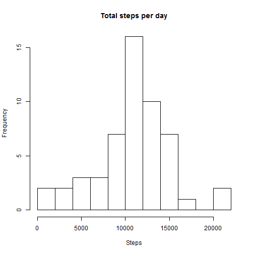
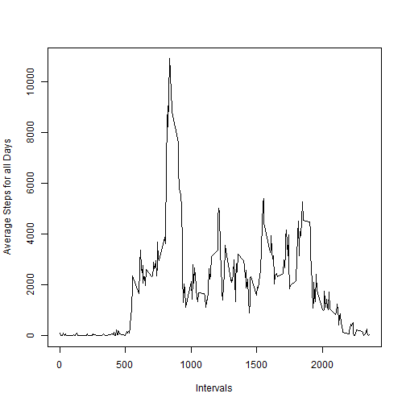
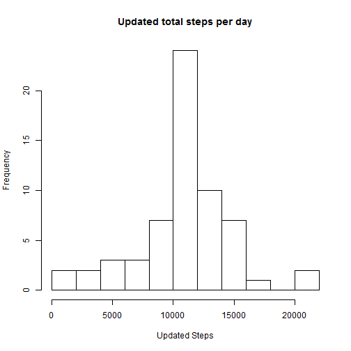
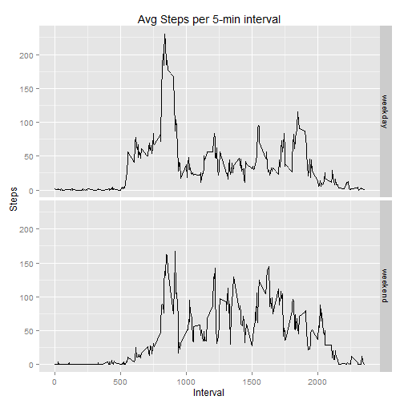

This is an R Markdown document. Markdown is a simple formatting syntax for authoring HTML, PDF, and MS Word documents. For more details on using R Markdown see <http://rmarkdown.rstudio.com>.

When you click the **Knit** button a document will be generated that includes both content as well as the output of any embedded R code chunks within the document. You can embed an R code chunk like this:


**1. What is mean total number of steps taken per day ?**


```r
data<-read.csv("activity.csv",header=TRUE,sep=",",colClasses ="character")
#get the clean data without na
dataClean<-na.omit(data)

#aggregating steps and interval perday
stepsDay<-aggregate(as.numeric(dataClean$steps)~dataClean$date,dataClean,sum)
intervalDay<-aggregate(as.numeric(dataClean$interval)~dataClean$date,dataClean,length)

#merge it to make perday dataframe and rename the headers
perdayData<-merge(stepsDay,intervalDay)
names(perdayData)<-c("Date","Steps","Interval")
#make histogram
hist(perdayData$Steps,breaks = "FD", main = "Total steps per day",xlab = "Steps")
```

 

```r
#to find means and median perday
meanSt<-mean(perdayData$Steps, na.rm = TRUE)
medianSt<- median(perdayData$Steps,na.rm=TRUE)
```

Mean is  : 1.0766189 &times; 10<sup>4</sup>

Median is : 1.0765 &times; 10<sup>4</sup>


**2.What is the average daily activity pattern ?**


```r
#sum of steps for all days, for each interval
stepsInterval<-aggregate(as.numeric(dataClean$steps)~as.numeric(dataClean$interval),dataClean,sum)
names(stepsInterval)<-c("interval","steps")

#plot the timeseries plot ( x axis is intervals, y axis is avg steps of all days)
plot(stepsInterval$interval,stepsInterval$steps,type="l" ,xlab="Intervals", ylab="Average Steps for all Days")
```

 

```r
#which interval has highest average activity
highInt<-stepsInterval[which.max(stepsInterval$steps),1]
```
Interval with highest activity is   : 835


**3.Imputing missing values ?**


```r
#total number of rows with NA's
test<-as.numeric(data$steps)
numNa<-length(test[is.na(test)])

#Devise a strategy for filling in all of the missing values in the dataset. The strategy does not need to be sophisticated. 
#For example, you could use the mean/median for that day, or the mean for that 5-minute interval, etc.

stepsInterval<-aggregate(as.numeric(dataClean$steps)~as.numeric(dataClean$interval),dataClean,sum)
names(stepsInterval)<-c("interval","steps")

#cals total number of days for which data is summed for each interval, value obtained is 53
stepsLength<-aggregate(as.numeric(dataClean$steps)~as.numeric(dataClean$interval),dataClean,length)

#stepmean calculated by dividing with number ofdays
stpM<-stepsInterval$steps/stepsLength[,2]

#Create a new dataset that is equal to the original dataset but with the missing data filled in.
replaceVals<-function(){
        dtStep<-data$steps        
        len1<-length(dtStep)
        len2<-length(stpM)
        index<-is.na(dtStep)
        for(i in 1:len1){
                val<-dtStep[i]   
                if (is.na(val)){
                        valInt<-data$interval[i] 
                        for (j in 1:len2){
                                if( as.numeric(valInt) == as.numeric(stepsInterval$interval[j])){                                        
                                       dtStep[i] = stpM[j]
                                                
                                }
                                                                
                        }
                }
        }
        
        dtStep        
}

#adding all the values in the new column vector
dtStep<-replaceVals()
#make a new datset from the original one
dataRep<-data
#replace the steps column with new framed column dtStep
dataRep$steps<-dtStep


#aggregating steps and interval perday
stepsDay1<-aggregate(as.numeric(dataRep$steps)~dataRep$date,dataRep,sum)
intervalDay1<-aggregate(as.numeric(dataRep$interval)~dataRep$date,dataRep,length)

#merge it to make perday dataframe and rename the headers
perdayData1<-merge(stepsDay1,intervalDay1)
names(perdayData1)<-c("Date","Steps","Interval")
#make histogram
hist(perdayData1$Steps,breaks = "FD", main = "Updated total steps per day",xlab = "Updated Steps")
```

 

```r
#to find new means and median
meanNew<- mean(perdayData1$Steps, na.rm = TRUE)
medianNew<-median(perdayData1$Steps, na.rm = TRUE)
```

Total Number of missing values          : 2304

New Mean is                             : 1.0766189 &times; 10<sup>4</sup>

New Median is                           : 1.0766189 &times; 10<sup>4</sup>


**4. Are there differences in activity patterns between weekdays and weekends ?**


```r
#calc with the weekdays function, which day is it from the date
weekD<-weekdays(as.Date(dataRep$date),abbreviate = FALSE)
#make the factor from the weekdays
fac<-factor(weekD,levels =c("Monday","Tuesday","Wednesday","Thursday","Friday","Saturday","Sunday"), 
            labels=c("weekday","weekday","weekday","weekday","weekday","weekend","weekend"))
```

```
## Warning in `levels<-`(`*tmp*`, value = if (nl == nL) as.character(labels)
## else paste0(labels, : duplicated levels in factors are deprecated
```

```r
#add a new column of factor variables
dataRep$category<-fac
head(fac)
```

```
## [1] weekday weekday weekday weekday weekday weekday
## Levels: weekday weekday weekday weekday weekday weekend weekend
```

```r
#split data by weekend and weekday
weekend <- dataRep[dataRep$category=="weekend",]
weekday <- dataRep[dataRep$category=="weekday",]

#calc avg by interval for weekdays
weekdayAvg <- aggregate(as.numeric(weekday$steps), list(as.numeric(weekday$interval)), mean,na.rm=TRUE)
weekdayAvg$category <- factor("weekday")

#calc avg by interval for weekends
weekendAvg <- aggregate(as.numeric(weekend$steps), list(as.numeric(weekend$interval)), mean,na.rm=TRUE)
weekendAvg$category <- factor("weekend")

names(weekdayAvg)<-c("interval","steps","category")
names(weekendAvg)<-c("interval","steps","category")

#display the data
library("ggplot2", lib.loc="~/R/win-library/3.1")
dataAvgInt <- rbind(weekdayAvg,weekendAvg)


qplot(dataAvgInt$interval, dataAvgInt$steps, data=dataAvgInt, 
      facets=category~., 
      geom="line", 
      xlab="Interval", 
      ylab="Steps", 
      main="Avg Steps per 5-min interval")
```

 
